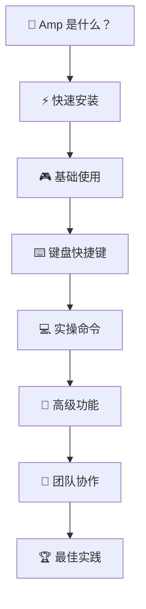

# Amp 中文学习资源库

> 为中文开发者提供全面的 Amp 学习材料和最佳实践指南

## 📖 项目简介

这是一个专为中文开发者创建的 **Amp 学习资源库**，包含从入门到精通的完整学习路径。Amp 是由 Sourcegraph 开发的革命性 AI 代理编码工具，正在改变软件开发的方式。

## 🎯 为什么需要这个项目？

- 🌏 **中文友好**：专为中文开发者量身定制的学习材料
- 📚 **系统完整**：从基础安装到高级技巧的完整覆盖
- 🌟 **社区驱动**：汇集真实社区经验和最佳实践
- 🚀 **快速上手**：小白也能快速掌握 Amp 的核心技能

## 📋 文档目录

### 📖 核心文档

| 文档 | 描述 | 适合人群 |
|------|------|----------|
| [用户手册](./doc/amp-user-manual.md) | 完整的入门指南，包含安装、使用、技巧 | 所有用户 |
| [社区最佳实践](./doc/amp-best-practices-from-community.md) | 来自 Twitter、Reddit 等社区的实战经验 | 进阶用户 |

### 🔧 配置文件

| 文件 | 描述 |
|------|------|
| [AGENT.md](./AGENT.md) | 项目配置和开发指南 |

## 🚀 快速开始

### 1. 安装 Amp

```bash
# 使用 npm
npm install -g @sourcegraph/amp

# 使用 pnpm
pnpm add -g @sourcegraph/amp

# 直接运行（无需安装）
npx @sourcegraph/amp
```

### 2. 阅读文档

**新手推荐路径：**
1. 📖 先阅读 [用户手册](./doc/amp-user-manual.md) 了解基础
2. 🎯 学习键盘快捷键提高效率
3. 💡 查看 [社区最佳实践](./doc/amp-best-practices-from-community.md) 掌握高级技巧

**快速体验：**
```bash
# 启动 Amp
amp

# 尝试第一个命令
> 你好，请介绍一下你的功能

# 生成代码示例
> 帮我写一个 Python 函数实现快速排序
```

## 🌟 核心特色

### 📚 完整的学习路径



### 🎯 涵盖的核心主题

- ✅ **基础入门**：安装、配置、第一次使用
- ✅ **高效操作**：键盘快捷键、工作流程优化
- ✅ **实战技巧**：代码生成、调试、重构、部署
- ✅ **团队协作**：线程分享、知识管理、最佳实践
- ✅ **高级功能**：子代理、Oracle、自定义工具
- ✅ **避坑指南**：常见问题、性能优化、质量控制

### 🌐 社区经验整合

从这些平台收集的真实经验：
- 🐦 **Twitter**: 开发者日常分享
- 📱 **Reddit**: 深度技术讨论  
- 🗞️ **HackerNews**: 行业趋势分析
- 📝 **官方博客**: 权威实践指导

## 📊 学习收益

使用这个资源库，你将获得：

- 🎯 **快速上手**：30分钟内掌握 Amp 基础操作
- 🚀 **效率提升**：学会 10+ 个高效工作流程
- 💡 **实战技能**：掌握 50+ 个实用命令和技巧
- 👥 **团队能力**：了解如何在团队中推广和使用
- 🏆 **最佳实践**：避免常见陷阱，直接应用成功经验

## 🤝 贡献指南

我们欢迎社区贡献！你可以：

### 📝 内容贡献
- 分享你的 Amp 使用经验
- 提供新的实用技巧和命令
- 翻译或改进现有文档
- 添加更多实战案例

### 🐛 问题反馈
- 报告文档中的错误或不准确之处
- 建议新的主题或改进方向
- 分享你遇到的问题和解决方案

### 📋 提交方式
1. Fork 这个项目
2. 创建你的功能分支
3. 提交你的更改
4. 发起 Pull Request

## 📞 获取帮助

### 🔗 相关链接
- [Amp 官网](https://ampcode.com/)
- [官方文档](https://ampcode.com/manual)
- [Discord 社区](https://discord.gg/amp)

### 💬 联系方式
- 在 GitHub Issues 中提问
- 参与项目讨论
- 分享使用心得

## 📈 项目状态

- ✅ **用户手册**：已完成，包含完整的入门到进阶内容
- ✅ **键盘快捷键**：已完成，覆盖所有平台和编辑器
- ✅ **社区最佳实践**：已完成，整合真实社区经验
- 🔄 **持续更新**：根据 Amp 的更新和社区反馈持续完善

## 📜 许可证

本项目采用 MIT 许可证，详见 [LICENSE](LICENSE) 文件。

## ⭐ 支持项目

如果这个项目对你有帮助，请：
- ⭐ 给项目点个 Star
- 🍴 Fork 并贡献内容
- 📢 推荐给其他开发者
- 💬 分享你的使用体验

---

> 💡 **记住**：Amp 不仅仅是一个工具，它代表了编程工作方式的根本性转变。拥抱这个变化，让 AI 成为你最强大的编程伙伴！

*最后更新: 2025年1月*
