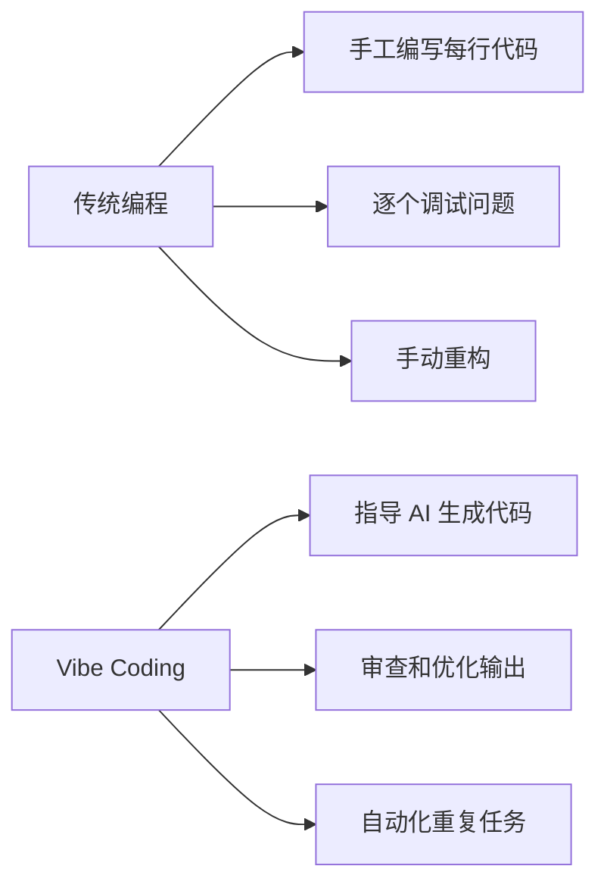

# Amp 社区最佳实践指南

> 从 Twitter、Reddit、HackerNews 等技术社区收集的 Amp 最佳实践经验

## 📋 目录

1. [核心理念：拥抱 "Vibe Coding"](#核心理念拥抱-vibe-coding)
2. [工作流程最佳实践](#工作流程最佳实践)
3. [提示词 (Prompting) 技巧](#提示词-prompting-技巧)
4. [多线程管理策略](#多线程管理策略)
5. [代码审查与质量控制](#代码审查与质量控制)
6. [团队协作经验](#团队协作经验)
7. [性能优化技巧](#性能优化技巧)
8. [避免常见陷阱](#避免常见陷阱)
9. [高级使用场景](#高级使用场景)
10. [社区经验分享](#社区经验分享)

---

## 核心理念：拥抱 "Vibe Coding"

### 什么是 Vibe Coding？

**Vibe Coding** 是一种全新的编程范式，开发者的角色从"编写代码"转变为"指导和生产代码"。



### 核心转变

**🔄 从写作者到导演**
```bash
# 传统方式
你: 手工编写每一行代码
时间: 大量时间花在编码实现上

# Vibe Coding 方式
你: 指导 AI 完成具体实现
AI: 生成代码、测试、文档
你: 审查、优化、决策
```

**📊 生产力提升数据（来自社区反馈）**
- 代码生成量：**70-80%** 由 AI 完成
- PR 提交频率：比传统方式高 **10倍**
- 开发效率：整体提升 **300-500%**

---

## 工作流程最佳实践

### 1. "数字填色"编程法（Thorsten Ball 经验）

**核心理念：** 你提供"数字"（需求、架构、约束），Amp 负责"填色"（实现代码）

```bash
# 你负责的部分 (数字)
- 架构设计
- 业务逻辑规划
- 测试策略
- 代码标准

# Amp 负责的部分 (填色)
- 具体代码实现
- 样板代码生成
- 重构执行
- 错误修复
```

### 2. 迭代式开发流程

```bash
# 推荐的开发循环
1. 📝 明确需求和上下文
   amp "基于现有架构，实现用户认证功能"

2. 🔍 审查生成的代码
   # 检查代码质量、架构一致性

3. 🧪 运行测试和构建
   amp "运行测试并修复所有失败的用例"

4. ✅ 验证和优化
   amp "截图这个 URL，验证 UI 是否正确显示"

5. 🔄 迭代改进
   # 根据反馈继续优化
```

### 3. 高效的任务分解策略

```bash
# ❌ 不推荐：混合复杂任务
amp "同时实现前端登录、后端API和数据库迁移"

# ✅ 推荐：任务分解
# 线程 1: 前端实现
amp "实现用户登录前端组件，使用 React 和 TypeScript"

# 线程 2: 后端 API
amp "创建用户认证 API 端点，包含登录和注册"

# 线程 3: 数据库设计
amp "设计用户表结构并创建迁移脚本"
```

---

## 提示词 (Prompting) 技巧

### 1. 详细上下文提供

**🎯 优秀提示词的要素：**

```bash
# 包含完整上下文的提示词示例
amp "
基于我们的 React + TypeScript 项目，实现一个用户设置页面：

**架构约束：**
- 使用现有的 UserContext
- 遵循 src/components 目录结构
- 使用 Styled Components 进行样式

**功能需求：**
- 编辑用户名、邮箱
- 密码修改功能
- 头像上传

**技术细节：**
- API 端点已存在：PUT /api/user/profile
- 错误处理使用 toast 通知
- 表单验证使用 Yup

**测试要求：**
- 单元测试覆盖所有功能
- 集成测试验证 API 调用

请先查看 src/components/UserProfile.tsx 了解现有代码结构
"
```

### 2. 明确指令而非模糊要求

```bash
# ❌ 模糊指令
amp "帮我优化这个代码"

# ✅ 明确指令  
amp "重构 UserService.js，将重复的 API 调用逻辑提取到 httpClient.js，并添加错误重试机制"

# ❌ 模糊查询
amp "找出谁写了这段代码"

# ✅ 明确查询
amp "使用 git blame 查看 src/auth/login.js 第 45-60 行的提交历史"
```

### 3. 渐进式任务规划

```bash
# 第一步：理解现状
amp "分析当前的用户认证流程，解释各个组件的作用"

# 第二步：提出改进
amp "基于上面的分析，如何优化认证流程以支持多因素验证？"

# 第三步：具体实现
amp "实现多因素验证功能，保持与现有代码的兼容性"
```

---

## 多线程管理策略

### 1. 线程生命周期管理

```bash
# 线程使用原则
🟢 新功能 = 新线程
🟡 相关修改 = 同一线程
🔴 上下文过大 = 压缩或新线程

# 实践示例
线程1: "实现购物车功能" (专注单一功能)
线程2: "修复购物车Bug" (相关修改)
线程3: "重构整个电商模块" (独立重构任务)
```

### 2. 并行开发策略

```bash
# 团队并行开发模式
开发者 A - 线程1: 前端组件开发
开发者 A - 线程2: API 接口设计
开发者 A - 线程3: 数据库优化

开发者 B - 线程4: 测试用例编写
开发者 B - 线程5: 部署脚本更新
开发者 B - 线程6: 文档更新
```

### 3. 上下文窗口优化

```bash
# 监控上下文使用
amp "检查当前线程的上下文使用情况"

# 当上下文接近限制时
选项1: 压缩线程 (保留重要信息)
选项2: 创建带摘要的新线程
选项3: 分解任务到多个线程

# 最佳实践
- 单个线程专注一个主要任务
- 定期检查上下文使用量
- 及时清理无关的上下文信息
```

---

## 代码审查与质量控制

### 1. 自动化代码审查

```bash
# 让 Amp 审查自己的工作
amp "检查 git diff --staged，审查即将提交的代码质量"

# 审查他人代码
amp "分析最近的 commit，检查是否符合我们的编码标准"

# 性能审查
amp "分析这个函数的性能瓶颈，提出优化建议"
```

### 2. 质量控制流程

```bash
# 完整的质量控制流程
1. 📝 代码生成
   amp "实现功能X"

2. 🔍 自动审查
   amp "审查上面生成的代码，检查潜在问题"

3. 🧪 测试验证
   amp "运行相关测试，确保没有破坏现有功能"

4. 📊 构建验证
   amp "运行 npm run build，修复所有错误和警告"

5. 📚 文档更新
   amp "更新相关文档，确保与代码同步"
```

### 3. 错误修复最佳实践

```bash
# 系统性错误修复
amp "运行完整测试套件，列出所有失败的测试"
amp "逐个修复上述测试失败，每次只修复一个"
amp "在修复每个问题后重新运行测试确认"

# 构建错误处理
amp "运行构建命令，收集所有错误信息"
amp "按优先级修复构建错误：类型错误 > 语法错误 > 警告"
```

---

## 团队协作经验

### 1. 线程分享策略

```bash
# 有效的线程分享
✅ 分享成功的解决方案
✅ 分享调试过程和思路
✅ 分享架构决策的讨论
✅ 分享代码审查的发现

# 线程分享最佳实践
1. 添加清晰的标题和描述
2. 包含相关的背景信息
3. 标明线程的目标和结果
4. 清理无关的调试信息
```

### 2. 团队知识管理

```bash
# 建立团队知识库
- 收集高质量的提示词模板
- 记录常见问题的解决方案
- 分享成功的工作流程
- 维护最佳实践文档

# 实践示例
amp "创建团队的 AGENT.md 模板，包含我们的编码标准"
amp "整理常用的提示词，创建团队提示词库"
```

### 3. 代码标准化

```bash
# 团队编码标准
amp "检查这段代码是否符合我们团队的 TypeScript 风格指南"
amp "将这个组件重构为符合我们的 React 组件架构模式"
amp "确保这个 API 接口符合我们的 REST API 设计规范"
```

---

## 性能优化技巧

### 1. Token 使用优化

```bash
# 监控 Token 消耗
- 跟踪每个线程的 token 使用量
- 优化提示词减少不必要的上下文
- 使用更精确的指令减少重复询问

# Token 使用最佳实践
✅ 精确的提示词 (减少来回确认)
✅ 适时的线程分割 (避免上下文过大)
✅ 重用成功的提示词模板
❌ 模糊的指令导致多次澄清
❌ 过长的单一线程
```

### 2. 并行处理优化

```bash
# 并行任务分配
# 同时启动多个线程处理独立任务
线程A: amp "优化数据库查询性能"
线程B: amp "重构前端组件架构" 
线程C: amp "更新API文档"

# 使用子代理处理大型任务
amp "使用子代理并行转换这5个组件为TypeScript"
```

### 3. 缓存和复用策略

```bash
# 建立可复用的代码模板
amp "创建用户管理的 CRUD 操作模板"
amp "基于上面的模板，为产品管理创建类似的 CRUD 功能"

# 复用成功的解决方案
amp "使用我们在用户认证中的错误处理模式"
amp "参考购物车组件的状态管理方式"
```

---

## 避免常见陷阱

### 1. 过度依赖问题

```bash
# 🚨 警告：代理成瘾症状
- 无法停止使用代理
- 感觉必须持续"喂养"代理任务
- 过度依赖代理做决策

# 🛡️ 预防措施
- 保持对架构和业务逻辑的控制
- 定期进行无代理编程练习
- 建立代理使用的时间限制
```

### 2. 上下文管理失误

```bash
# ❌ 常见错误
- 单个线程处理过多不相关任务
- 忽略上下文窗口限制警告
- 没有及时清理无用信息

# ✅ 正确做法
- 一个线程专注一个主要任务
- 监控上下文使用情况
- 定期压缩或分割线程
```

### 3. 代码质量控制缺失

```bash
# 🚨 质量风险
- 盲目接受代理生成的代码
- 跳过测试和审查环节
- 忽略代码标准和最佳实践

# 🛡️ 质量保证
- 始终审查代理生成的代码
- 运行完整的测试套件
- 确保符合团队编码标准
```

---

## 高级使用场景

### 1. 可视化和图表

```bash
# 使用截图进行反馈
amp "截图 http://localhost:3000/dashboard 并分析UI布局问题"
amp "查看这个错误截图，帮我调试问题"

# 生成架构图表
amp "创建系统架构的 Mermaid 图表，显示各服务间的关系"
amp "绘制用户认证流程的时序图"
```

### 2. 数据库操作

```bash
# 数据库管理
amp "连接到 PostgreSQL 数据库，分析用户表的数据分布"
amp "编写 SQL 查询统计最近30天的用户活跃度"
amp "创建数据库迁移脚本，添加新的索引优化查询"
```

### 3. 部署和运维

```bash
# 部署自动化
amp "创建 Docker 配置文件，包含多阶段构建优化"
amp "编写 GitHub Actions 工作流，实现自动测试和部署"
amp "生成 Kubernetes 配置文件，配置服务和负载均衡"
```

### 4. Git 工作流集成

```bash
# Git 操作自动化
amp "分析 git log --oneline --since='1 week ago'，总结本周的开发活动"
amp "检查 git diff HEAD~5，审查最近5次提交的代码质量"
amp "使用 git blame 查找引入特定bug的提交"
```

---

## 社区经验分享

### 1. 来自 Thorsten Ball 的实战经验

**核心理念：** "数字填色"编程法

```bash
# Thorsten 的工作流程
1. 在 VS Code 侧边栏使用 Amp (⌘I, ⌘L)
2. 提供详细的架构和约束信息
3. 利用截图验证 UI 组件修改
4. 使用 git staging area 作为安全网
5. 频繁开启新线程保持上下文清晰

# 他的成功案例
- 70-80% 的代码由 Amp 生成
- 大幅减少手动编码时间
- 显著提高代码审查和重构效率
```

### 2. 来自技术社区的反馈

**开发者生产力提升：**

```bash
# 社区统计数据
📈 代码提交频率：10x 提升
📈 功能开发速度：3-5x 提升  
📈 Bug 修复效率：显著提升
📈 代码重构能力：大幅增强

# 开发者体验反馈
"感觉像在'飞翔'，每次操作都更有分量"
"从不确定到兴奋，探索更多可能性"
"IDE 使用频率大幅下降，更喜欢代理工作流"
```

### 3. 行业趋势观察

**"Brute Squad" 现象：**

```bash
# 新的开发范式
- 开发者 + 多个代理 = 超级生产力团队
- 传统 IDE 使用率下降
- 基于终端的工作流程兴起
- 代理协作成为核心技能

# 组织层面的变化
- Token 消耗成为生产力指标
- 代理使用能力影响绩效评估
- 团队协作模式重新定义
```

---

## 🎯 快速行动指南

### 立即开始的 5 个步骤

```bash
1. 🎬 改变思维方式
   从"编写代码"转向"指导代码生产"

2. 📝 优化提示词
   学习编写详细、明确的指令

3. 🧵 管理线程
   一个线程专注一个任务

4. 🔍 建立审查流程
   始终验证代理生成的代码

5. 👥 团队分享
   积极分享成功经验和线程
```

### 避免的 5 个错误

```bash
1. ❌ 模糊的指令导致低效沟通
2. ❌ 单线程处理过多复杂任务  
3. ❌ 跳过代码审查和测试
4. ❌ 过度依赖代理做架构决策
5. ❌ 忽略团队协作和知识分享
```

---

## 📚 延伸阅读

- [Amp 官方文档](https://ampcode.com/manual)
- [Thorsten Ball: How I Use Amp](https://ampcode.com/how-i-use-amp)
- [Sourcegraph Blog: The Brute Squad](https://sourcegraph.com/blog/the-brute-squad)
- [Sourcegraph Blog: Death of the Junior Developer](https://sourcegraph.com/blog/the-death-of-the-junior-developer)

---

## 🤝 社区反馈

这个文档基于真实的社区经验整理，如果你有新的最佳实践或改进建议，欢迎：

- 在团队中分享你的成功线程
- 贡献新的提示词模板
- 分享踩坑经验和解决方案
- 参与社区讨论和知识分享

---

*最后更新: 2025年1月*  
*数据来源: Twitter, Reddit, HackerNews, Sourcegraph Blog*

> 💡 **记住**: Amp 不仅仅是一个工具，它代表了编程工作方式的根本性转变。拥抱这个变化，让 AI 成为你最强大的编程伙伴！
